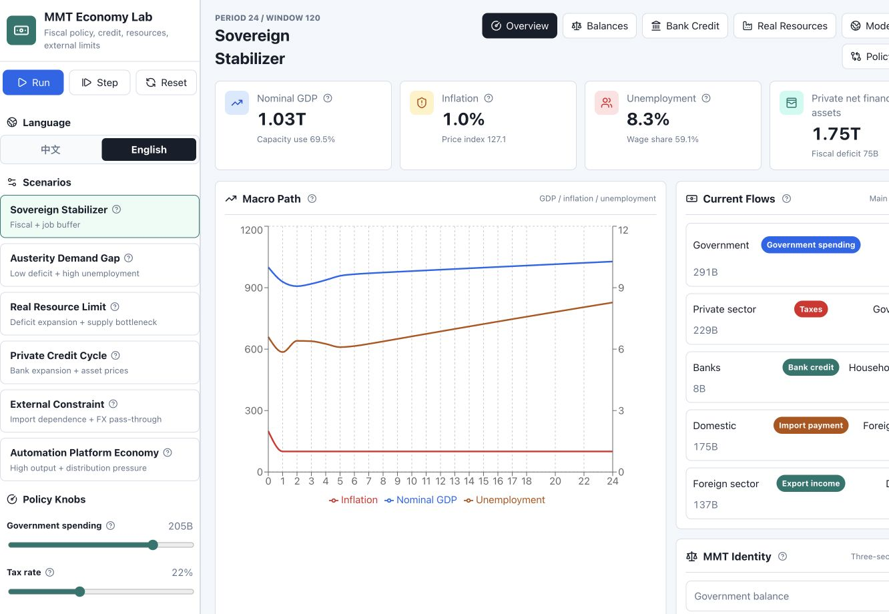

# MMT Economy Lab


An interactive MMT and modern monetary economy sandbox for learning how fiscal policy, bank credit, real resources, external constraints, asset prices, inequality, and automation interact.

[Report an issue](https://github.com/haowen-xiong/mmt-economy-lab/issues) · [Contribute](CONTRIBUTING.md) · [Deploy with GitHub Pages](#deploy)



## Why This Exists

Most macro explainers show one mechanism at a time. MMT Economy Lab puts the accounting, credit, real-resource, external-sector, and social-structure layers in the same interface so learners can ask better questions:

- What happens when a sovereign-currency government increases spending while real capacity is still available?
- When does fiscal expansion become inflation pressure instead of real output?
- How do bank loans create deposits, and how does deleveraging destroy them?
- How do imports, exports, and exchange-rate pressure change the fiscal story?
- Who gains or loses across workers, asset-rich households, firms, banks, government, foreign sector, and platform capital?

The app defaults to English and includes a sidebar language switch for Chinese.

## Highlights

- **Sectoral balances:** government, private, and foreign balances always close to the accounting identity.
- **Policy knobs:** tune spending, taxes, job guarantee support, rates, credit impulse, productivity, imports, energy costs, automation, exports, and transfers.
- **Policy comparison:** compare scenarios against the current slider policy with growth, stress, and scorecard views.
- **Social actor map:** translate macro variables into household, firm, bank, state, foreign, and platform-sector exposure.
- **Real-resource framing:** separate nominal spending capacity from actual capacity, inflation, employment, and supply constraints.
- **Bilingual UI:** English by default, with Chinese available in one click.

## Model Boundary

This is a teaching and reasoning tool, not a calibrated forecasting model. It is not investment advice, fiscal advice, or public policy advice. The amounts, ratios, and parameters are designed to make mechanisms visible: how sectoral balances close, how fiscal deficits affect private net financial assets, how bank lending creates deposits, and how real resource constraints can turn into inflation pressure.

The model is organized through an MMT lens, but it is intentionally simplified. It does not include full price formation, industrial structure, central-bank operating details, political constraints, or international capital flows. Use it to ask questions, compare mechanisms, and support learning. Do not directly extrapolate its outputs to any real country or market.

## Run Locally

```bash
npm install
npm run dev -- --host 127.0.0.1
```

Open:

```text
http://127.0.0.1:5173/
```

## Validate

```bash
npm run check
```

This runs linting, model tests, and a production build.

## Deploy

The repository includes a GitHub Pages deployment workflow. To publish the live demo:

1. Open repository settings on GitHub.
2. Go to **Pages**.
3. Set the source to **GitHub Actions**.
4. Run the **Deploy GitHub Pages** workflow.

The Vite build automatically uses `/mmt-economy-lab/` as the asset base when `GITHUB_PAGES=true`.

## Project Structure

- `src/simulation.ts`: core economy model and scenario definitions.
- `src/derivedMetrics.ts`: comparison scoring and social actor derived views.
- `src/App.tsx`: application state, copy, charts, and panels.
- `src/App.css`: responsive layout and visual system.
- `.github/workflows/`: CI and GitHub Pages deployment.

## Contributing

Good contributions usually improve one of three things:

- **Learning clarity:** better explanations, better examples, clearer scenario naming.
- **Model quality:** more coherent policy transmission, stronger invariants, better tests.
- **Product polish:** visual clarity, responsiveness, accessibility, and shareability.

Start with [CONTRIBUTING.md](CONTRIBUTING.md).

## License

MIT License. See [LICENSE](LICENSE).
